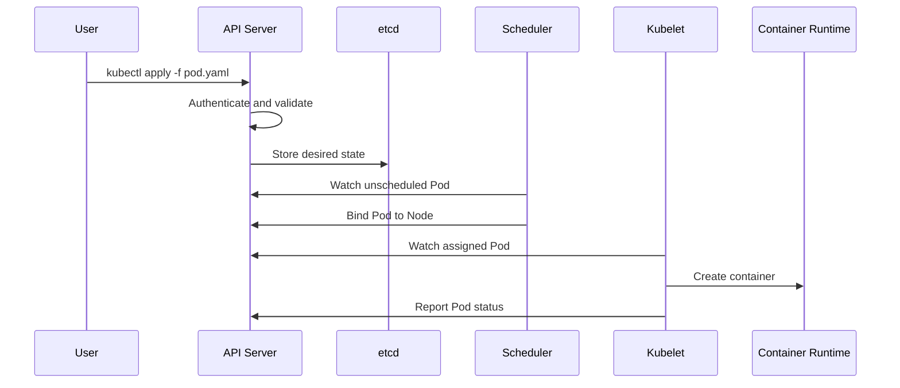

# Kubernetes Architecture

## Target

Understand what happens from `kubectl apply` until a container runs on a node.

## Core components

| Component | Responsibility |
|---|---|
| API Server | Kubernetes control-plane API |
| etcd | Persistent desired and observed state |
| Scheduler | Selects a node for a new Pod |
| Controller Manager | Reconciles actual state with desired state |
| Kubelet | Runs and monitors workloads assigned to its node |
| Container runtime | Pulls images and starts containers |

!!! note
    Kubernetes is a reconciliation system. You declare desired state; controllers continuously attempt to make actual state match it.
