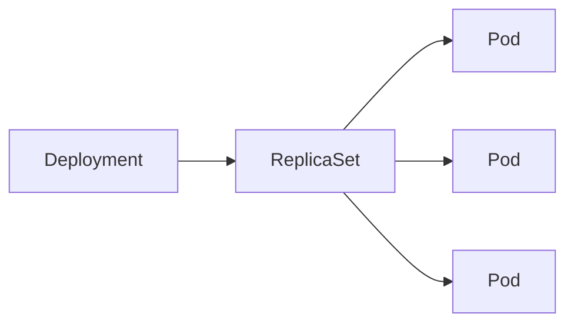

# Deployment

## Target

Maintain replicas and perform controlled application updates.



```yaml
apiVersion: apps/v1
kind: Deployment
metadata:
  name: web
spec:
  replicas: 3
  selector:
    matchLabels:
      app: web
  template:
    metadata:
      labels:
        app: web
    spec:
      containers:
        - name: nginx
          image: nginx:1.27
          ports:
            - containerPort: 80
```

```bash
kubectl rollout status deployment/web
kubectl scale deployment/web --replicas=5
kubectl set image deployment/web nginx=nginx:1.27.1
kubectl rollout history deployment/web
kubectl rollout undo deployment/web
```
