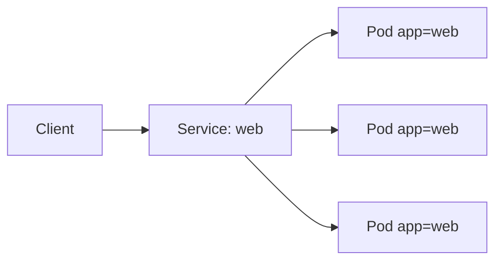

# Service

## Target

Provide a stable virtual IP and DNS name for a changing group of Pods.



The Service selector must match the Pod labels.

```yaml
apiVersion: v1
kind: Service
metadata:
  name: web
spec:
  selector:
    app: web
  ports:
    - port: 80
      targetPort: 80
```

```bash
kubectl get service web
kubectl get endpoints web
kubectl describe service web
```

An empty endpoint list usually indicates a selector or readiness problem.
