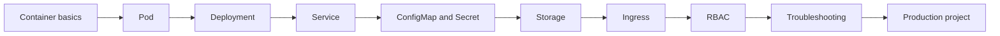

# Kubernetes Learning Dashboard

  <h2>Learn concepts. Run labs. Break things. Fix them.</h2>
  
A practical Kubernetes learning route from beginner to production troubleshooting.

## Current target

Complete the first three beginner labs:

- [ ] Create and inspect a Pod
- [ ] Create, scale and update a Deployment
- [ ] Expose an application using a Service

  <strong>Your browser progress</strong>
  

  
0 practices completed

## Learning route

## How to use this portal

1. Read one concept for no more than 10 minutes.
2. Start its practice immediately.
3. Validate the result using the supplied commands.
4. Intentionally introduce the listed failure.
5. Fix it without opening the solution.
6. Mark the practice complete.
7. Take the exam after finishing a module.
